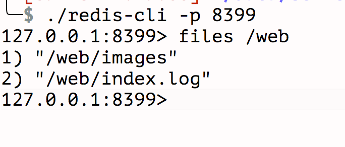

[TOC]

### purpose
* 解决只能通过ftp上传资源，方便服务器逻辑动态生成资源并同步到ftp

### version
```
v0.0.5
```

### usage
```
./bin/goRedisFtpSync --config=config.xml

./redis-cli -p 8399
127.0.0.1:8399> files /
1) "/1.php"
2) "/test"
3) "/web"
127.0.0.1:8399> ftpsync /data/nice.gif /web/images/hello.gif
OK
127.0.0.1:8399> ftpasync /data/nice.gif /web/images/hello.gif
OK
127.0.0.1:8399> files / 1
1) "/1.php"
2) "/test"
3) "/test/php"
4) "/test/php/online"
5) "/test/php/online/test.php"
6) "/web"
7) "/web/images"
8) "/web/images/hello.gif"
9) "/web/index.log"
127.0.0.1:8399> delete /1.php
(integer) 1
127.0.0.1:8399> files /
1) "/test"
2) "/web"
127.0.0.1:8399> files / 1
1) "/test"
2) "/test/php"
3) "/test/php/online"
4) "/test/php/online/test.php"
5) "/web"
6) "/web/images"
7) "/web/images/hello.gif"
8) "/web/index.log"
127.0.0.1:8399>
```

### command
```
ping {message}
ftpsync {local file} {remote file}
ftpasync {local file} {remote file}
files {remote folder} {recursion default 0}
exists {remote file}
delete {remote file}  {async default 0}
```

### config
```
<?xml version="1.0" encoding="UTF-8" ?>
<config>
    <listen>0.0.0.0:8399</listen>
    <ftp>
        <address>192.168.1.155:21</address>
        <user>anonymous</user>
        <password>anonymous</password>
    </ftp>
</config>
```

### screenshot




### example
```
<?php

$redis_handle = new Redis();
$redis_handle->connect('127.0.0.1', 8399, 30);
//同步上传
$redis_handle->rawCommand('ftpsync', '/data/nice.gif', '/web/images/hello.gif');
//拉取列表
$result = $redis_handle->rawCommand('files', '/web');
//删除
$redis_handle->rawCommand('delete', '/web/images/hello.gif');
//是否存在
$redis_handle->rawCommand('exists', '/web/images/hello.gif');
```

### deps
* https://github.com/jonnywang/go-kits/redis
* https://github.com/jlaffaye/ftp

### faq
* qq群 233415606