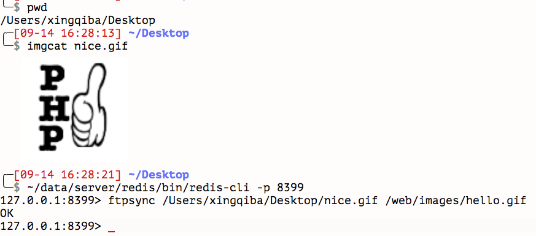
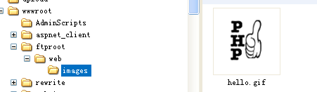

[TOC]

### version
```
v0.0.1
```

### usage
```
./bin/goRedisFtpSync --config=config.xml

./redis-cli -p 8399
127.0.0.1:8399> ftpsync /data/nice.gif /web/images/hello.gif
OK
127.0.0.1:8399>
```

### command
```
ping {message}
ftpsync {local file} {remote file}
```

### config
```
<?xml version="1.0" encoding="UTF-8" ?>
<config>
    <listen>0.0.0.0:8399</listen>
    <ftp>
        <address>192.168.1.155:21</address>
        <user>anonymous</user>
        <password>anonymous</password>
    </ftp>
</config>
```

### screenshot




### deps
* https://github.com/jonnywang/go-kits/redis
* https://github.com/jlaffaye/ftp

### faq
 * qq群 233415606